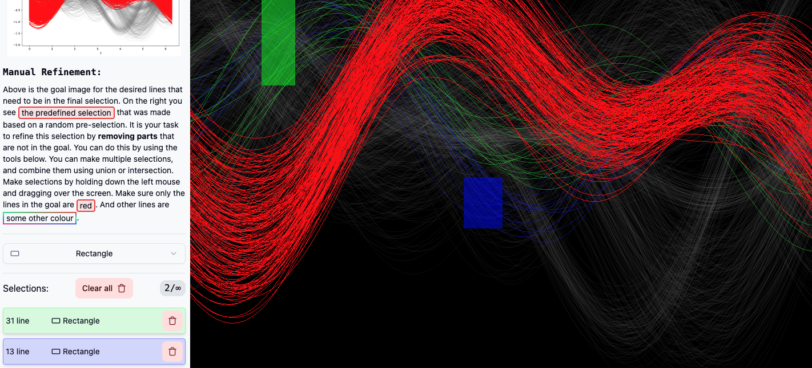

## Tutorial

In the next few screen you will see a pre-selection made by us as researcher. Your goal will be to refine the selection by removing certain lines from the pre-selection in order to get closer to the final goal. This tutorial will briefly show how to use the interface. Do keep in mind that the interfaces will be shown in random order.

## Manual refinement

The manual refinement interface allows you to remove lines from a pre-selection. By default, a rectangular selection is made once you drag your mouse over the lines.

Each selection displays with color coding which lines are part of your selection (green and blue).

Each selection shows the number of lines that are part of the selection. The green selection is 31 lines, the blue selection is 13 lines. On the right of each selection you can delete a selection by clicking the trash can icon.

You can decide to combine these lines using a union or intersection operation. The union operation will combine all lines that are part of either selection. The intersection operation will only keep the lines that are part of both selections.

There are two additional brushes besides the rectangular brush. The angle brush lets you select lines based on their angles, specifically those that are perpendicular to the brush. The lasso brush enables you to draw a freeform shape to select lines.

## Semi automatic refinement

The semi-automatic refinement interface allows you to remove lines from a pre-selection. You can adjust the slider from either the left or the right side. Colours indicate which lines are closer to the mode (yellow) and which lines are further away (purple).

## Automatic refinement

The automatic refinement interface allows you to remove lines from a pre-selection. You can adjust the buttons to either keep or remove the lines from the selection. Colours indicate which lines are in which cluster. In this example the algorithm has found 5 clusters.

